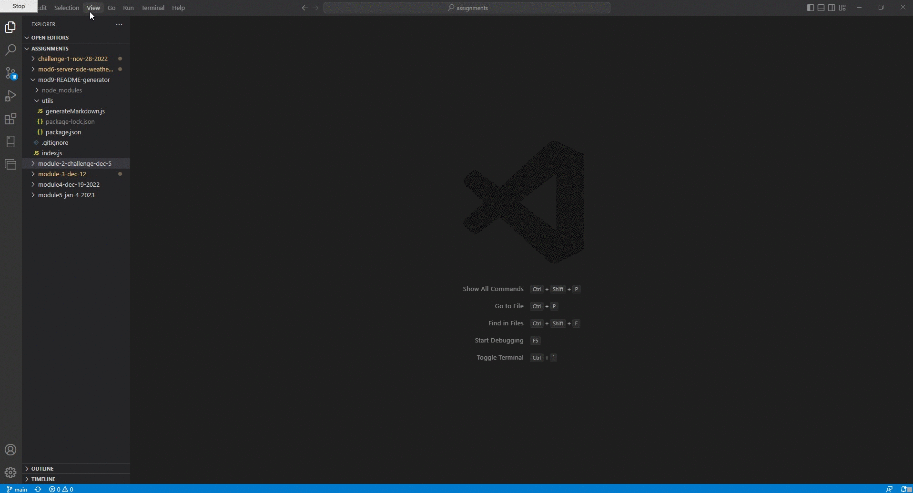

# README Generator
AS A developer
I WANT a README generator
SO THAT I can quickly create a professional README for a new project

## Module 9 Challenge Feb 2, 2023

* Video: https://www.youtube.com/watch?v=Inm1pexZL4g
* GitHub: https://github.com/Ryebread5555/mod9-README-generator

## Acceptance Criteria
```
-GIVEN a command-line application that accepts user input
-WHEN I am prompted for information about my application repository
-THEN a high-quality, professional README.md is generated with the title of my project and sections entitled Description, Table of Contents, Installation, Usage, License, Contributing, Tests, and Questions
-WHEN I enter my project title
-THEN this is displayed as the title of the README
-WHEN I enter a description, installation instructions, usage information, contribution guidelines, and test instructions
-THEN this information is added to the sections of the README entitled Description, Installation, Usage, Contributing, and Tests
-WHEN I choose a license for my application from a list of options
-THEN a badge for that license is added near the top of the README and a notice is added to the section of the README entitled License that explains which license the application is covered under
-WHEN I enter my GitHub username
-THEN this is added to the section of the README entitled Questions, with a link to my GitHub profile
-WHEN I enter my email address
-THEN this is added to the section of the README entitled Questions, with instructions on how to reach me with additional questions
-WHEN I click on the links in the Table of Contents
-THEN I am taken to the corresponding section of the README
```

## Function
- README generator allows you to create a README file for all projects using nodejs, VS Code terminal, or GitBash.
- A series of questions are provided to the user that they answer and are put onto a README file.
- README has clickable directories for the user to easily navigate through.
- Ease of use for all projects!

## Languages
- JavaScript
- nodejs


## Mock-up


## Video
